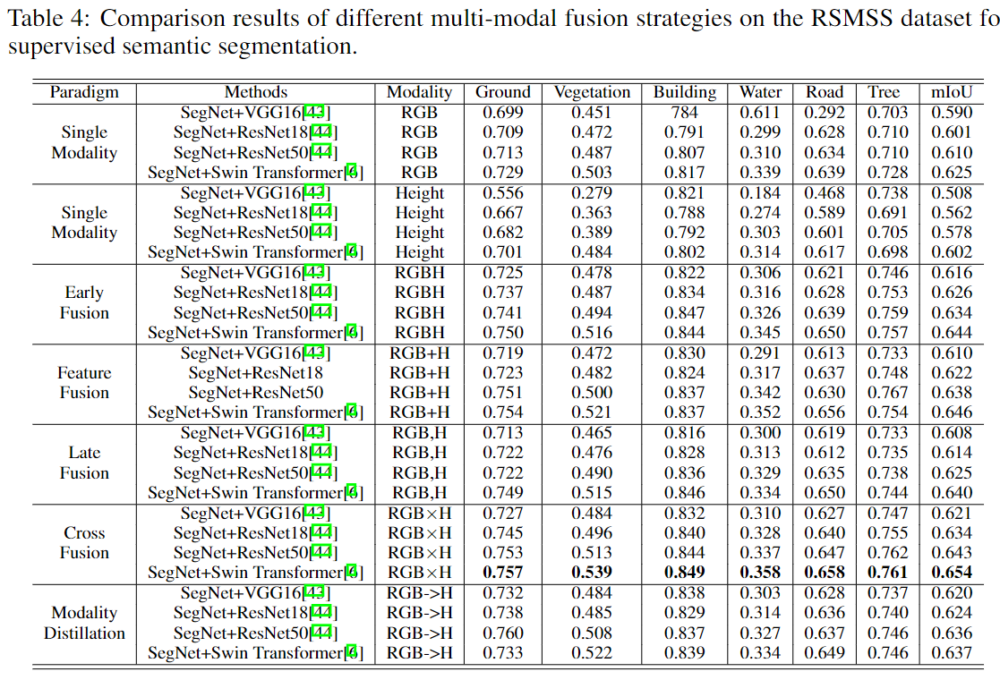
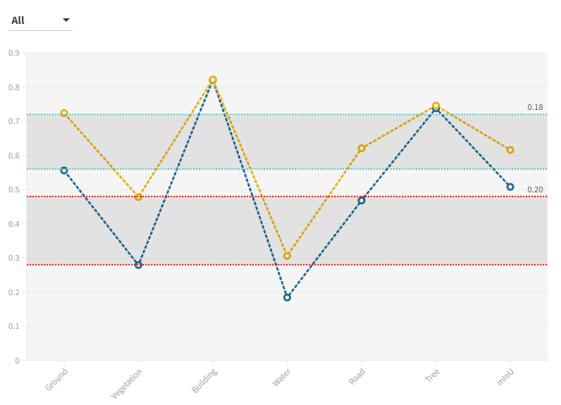
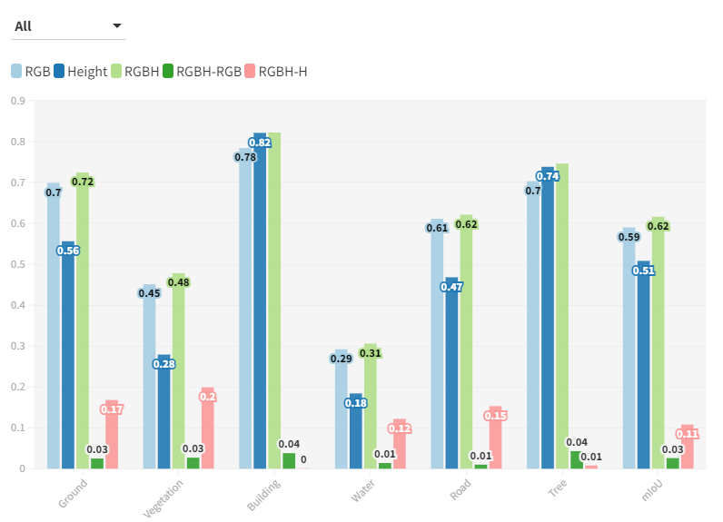
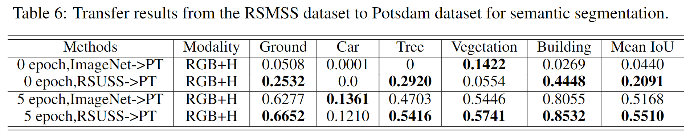

# RSI-MMSegmentation

Official code for:
## GAMUS: A Geometry-aware Multi-modal Semantic Segmentation Benchmark for Remote Sensing Data

The proposed benchmark dataset RSMSS can be donwloaded from the following [link](https://syncandshare.lrz.de/getlink/fi8rRALX7JwWtMaSH1jpxiVA/RSUSS.zip):
1. https://syncandshare.lrz.de/getlink/fi8rRALX7JwWtMaSH1jpxiVA/RSUSS.zip
2. https://mediatum.ub.tum.de/1661568

    
 

# Add results of using only the height modality

    
 

  Comparison results of different multi-modal fusion methods on the RSMSS dataset for supervised semantic segmentation。

    
 

  Comparison results of different multi-modal fusion strategies on the RSMSS dataset for supervised semantic segmentation.

# Add visualization examples of different multi-modal fusion methods

    
 

  updating more visualization results...

# Add comparison and analysis of multiple modalities

    

  Clicking on the pictures to view the data in an interactive way!

# Add experiments to study the transferability

    
 

We transfer the trained network weights from the proposed RSUSS dataset to the ISPRS Potsdam ataset. 
For the zero-shot transfer learning results, weights learned from our dataset can be directly transferred to the Potsdam dataset.
The results is no-doubt higher than that of weights from ImageNet. 
By fine-tuning the model on Potsdam dataset for 5 epochs, our results is clearly higher than weights from ImageNet. 

