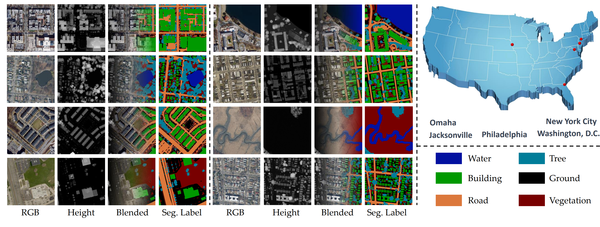
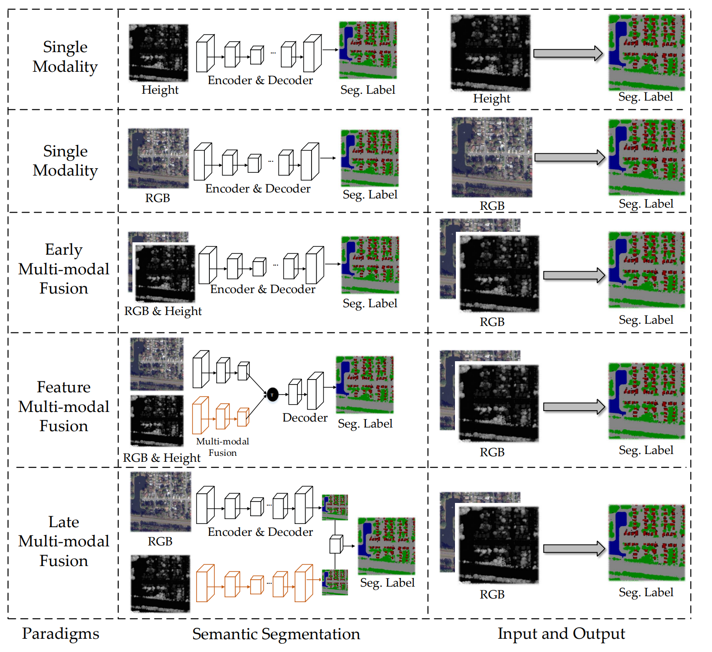
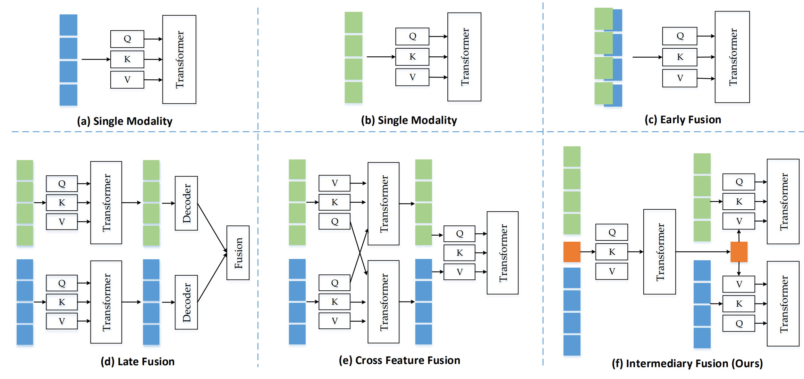
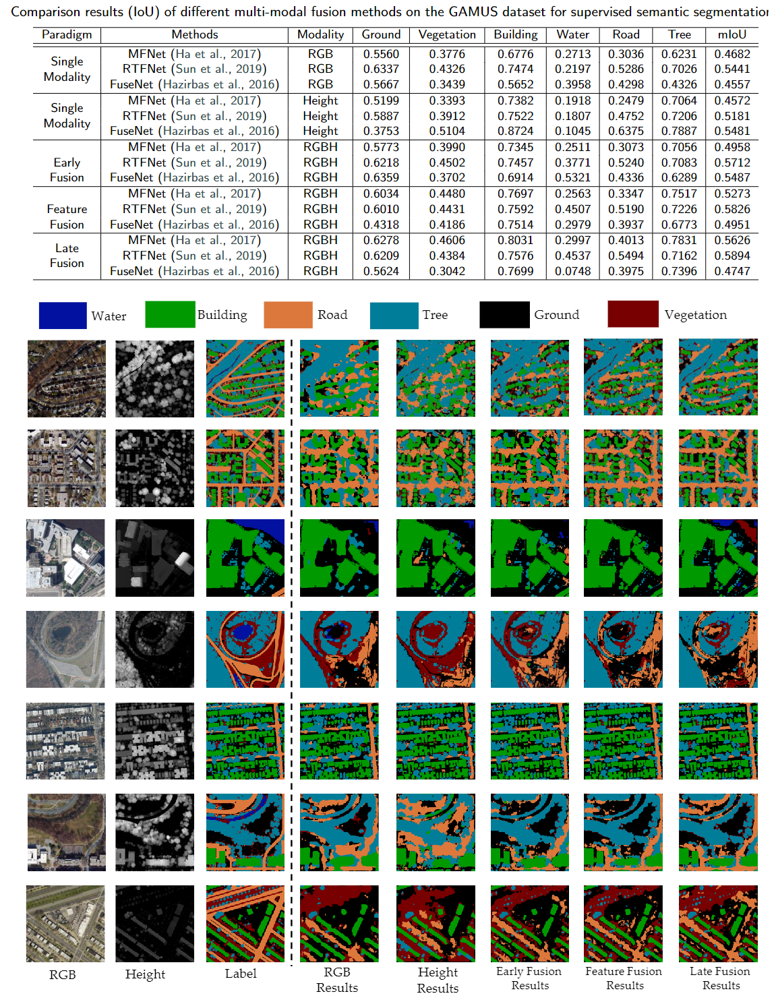

# RSI-MMSegmentation

Official code for:
## GAMUS: A Geometry-aware Multi-modal Semantic Segmentation Benchmark for Remote Sensing Data

The proposed benchmark dataset RSMSS can be donwloaded from the following [link](https://syncandshare.lrz.de/dl/fiBpfqvv7QE3MxRC18Uocq/GAMUS.zip):
https://syncandshare.lrz.de/dl/fiBpfqvv7QE3MxRC18Uocq/GAMUS.zip

# Add results of using only the height modality

<div  align="center">    
 
</div>

  Comparison results of different multi-modal fusion methods on the RSMSS dataset for supervised semantic segmentation。

<div  align="center">    
 
</div>

<div  align="center">    
 
</div>

  Comparison results of different multi-modal fusion strategies on the RSMSS dataset for supervised semantic segmentation.

# Add visualization examples of different multi-modal fusion methods

<div  align="center">    
 
</div>

# References
```
@article{xiong2023gamus,
  title={GAMUS: A Geometry-aware Multi-modal Semantic Segmentation Benchmark for Remote Sensing Data},
  author={Xiong, Zhitong and Chen, Sining and Wang, Yi and Mou, Lichao and Zhu, Xiao Xiang},
  journal={arXiv preprint arXiv:2305.14914},
  year={2023}
}
```
