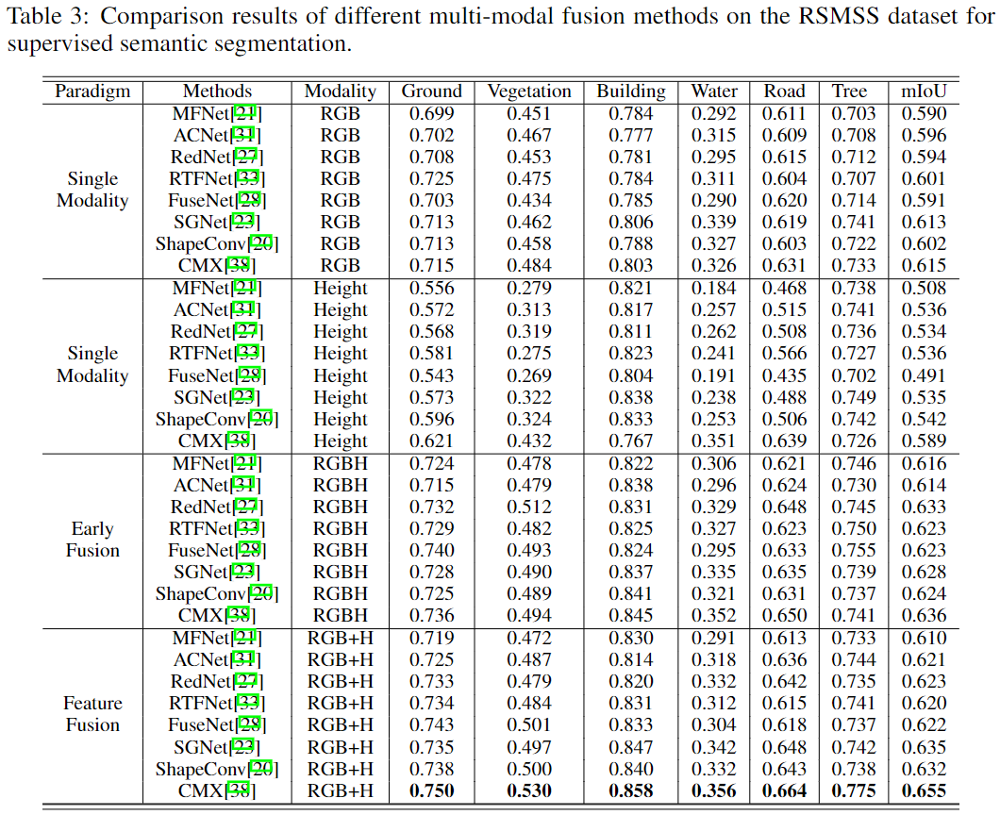

# RSI-MMSegmentation

Official code for Parse Semantics from Geometry: A Remote Sensing Benchmark for Multi-modal Semantic Segmentation.

# Add results of using only the height modality

    
 

coming soon

# Add visualization exsamples of different multi-modal fusion methods

coming soon
